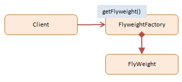

### Flyweight

Use sharing to support large numbers of fine-grained objects efficiently.

Shared flyweight objects are immutable, that is, they cannot be changed as they 
represent the characteristics that are shared with other objects.

Essentially Flyweight is an 'object normalization technique' in which common properties 
are factored out into shared flyweight objects. (Note: the idea is similar to data model 
normalization, a process in which the modeler attempts to minimize redundancy).

An example of the Flyweight Pattern is within the JavaScript engine itself which 
maintains a list of immutable strings that are shared across the application.

